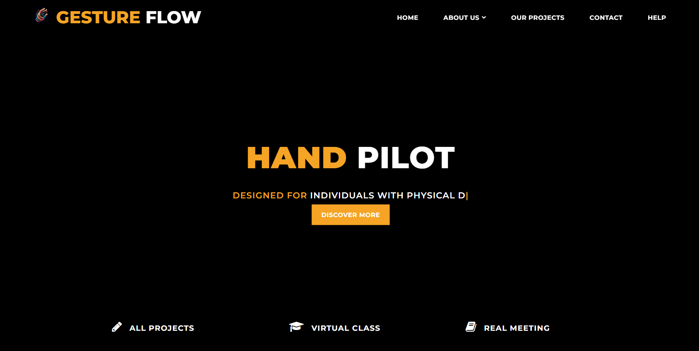
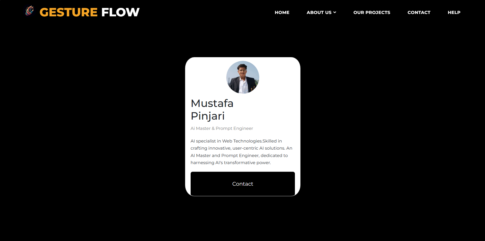
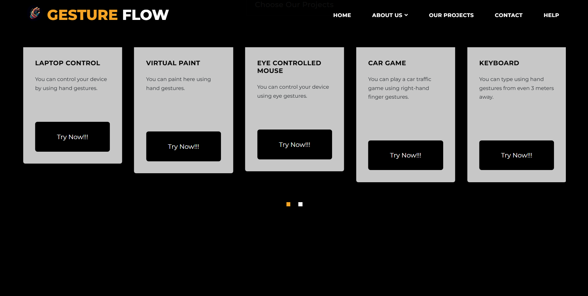
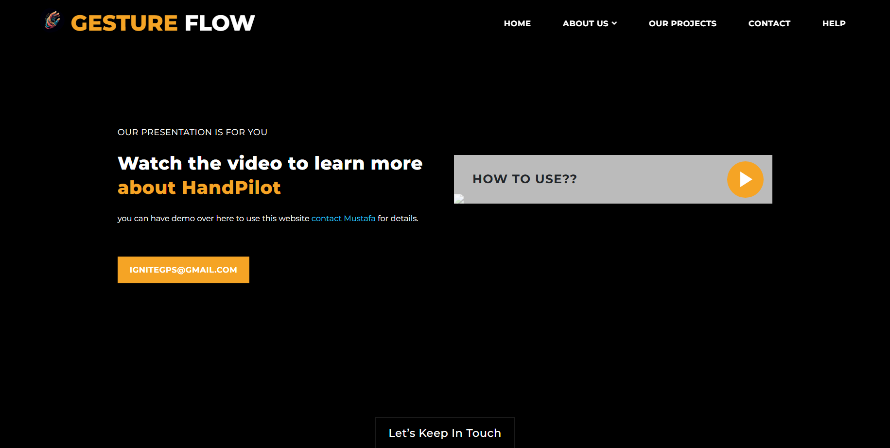

# GuestureFlow 🚀

GuestureFlow is a cutting-edge project designed to help users interact with their devices using hand gestures. It aims to provide a seamless and intuitive interface for individuals with physical disabilities, fitness enthusiasts, technology users, and more.

## Table of Contents 📖
- [About the Project](#about-the-project)
- [Features](#features)
- [Technologies Used](#technologies-used)
- [Getting Started](#getting-started)
- [Usage](#usage)
- [Screenshots](#screenshots)
- [Contributing](#contributing)
- [License](#license)
- [Contact](#contact)

## About the Project 📚

GuestureFlow leverages AI and computer vision to interpret hand gestures and convert them into actions on a device. Whether you want to control volume, navigate your laptop, or even play a car game, GuestureFlow makes it possible with just a wave of your hand.

## Features 🌟

- 🎛️ **Volume Control**: Adjust your device's volume with hand gestures.
- 💻 **Laptop Control**: Navigate your laptop using hand gestures.
- 🎨 **Virtual Paint**: Draw and paint using hand gestures.
- 👀 **Eye Controlled Mouse**: Control your mouse cursor using eye gestures.
- 🚗 **Car Game**: Play a car game using right-hand finger gestures.
- ⌨️ **Keyboard**: Type using hand gestures from up to 3 meters away.
- 🏋️ **AI Personal Gym Trainer**: Receive workout guidance from an AI trainer.
- 🌞 **Brightness Control**: Adjust screen brightness using hand gestures.

## Technologies Used 🛠️

- HTML5 & CSS3
- Bootstrap
- JavaScript (Typed.js, jQuery)
- Django (for server-side rendering and URL routing)
- Python (for AI and gesture recognition)
- Google Fonts
- Font Awesome

## Getting Started 🚀

To get a local copy up and running, follow these simple steps.

### Prerequisites 📋

- Python 3.x
- Django
- Virtual Environment (Optional but recommended)

### Installation 💻

1. Clone the repository
   ```sh
   git clone https://github.com/MustafaPinjari/guesture-flow.git
   ```
2. Navigate to the project directory
   ```sh
   cd GuestureFlow
   ```
3. Create a virtual environment (optional but recommended)
   ```sh
   python -m venv venv
   source venv/bin/activate   # On Windows: venv\Scripts\activate
   ```
4. Install the required packages
   ```sh
   pip install -r requirements.txt
   ```
5. Run the Django development server
   ```sh
   python manage.py runserver
   ```

## Usage 🎮

To use GuestureFlow, follow these steps:

1. Open your web browser and navigate to `http://127.0.0.1:8000`.
2. Explore the various features through the navigation menu.
3. Use the "Try Now!!!" buttons to test different gesture control scripts.

## Screenshots 📸

### Home Page 🏠


### About Us 📖


### Projects 📂


### Contact 📞


## Contributing 🤝

Contributions are what make the open-source community such an amazing place to learn, inspire, and create. Any contributions you make are **greatly appreciated**.

1. Fork the Project
2. Create your Feature Branch (`git checkout -b feature/AmazingFeature`)
3. Commit your Changes (`git commit -m 'Add some AmazingFeature'`)
4. Push to the Branch (`git push origin feature/AmazingFeature`)
5. Open a Pull Request

## License 📄

Distributed under the MIT License. See `LICENSE` for more information.

## Contact 📧

Mustafa Pinjari - [unlessuser99@gmail.com](unlessuser99@gmail.com)
Website - [Mustafa Pinjari](https://mustafapinjari.netlify.app)

Project Link: [https://github.com/your-username/GuestureFlow](https://github.com/MustafaPinjari/guesture-flow)